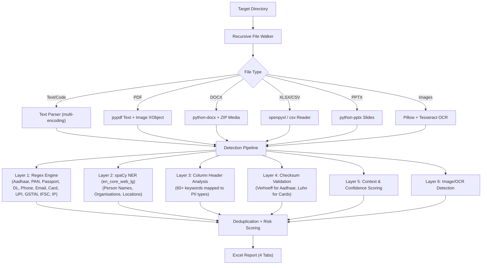

# Technical Documentation — PII Data Discovery Tool v3.0 (India Focus)

**Version**: 3.0.0  
**Target Market**: Indian Consulting Firms & Audit Teams  
**Deployment Model**: 100% Offline | Zero Data Egress | Standalone Python  

---

## Applicable Indian Laws & Regulators

| Regulator / Law | Scope |
| :--- | :--- |
| **DPDP Act, 2023** | Primary legislation for digital personal data protection |
| **DPDP Rules, 2025** | Implementing rules (notified Nov 2025). Consent Managers, 72-hr breach notification, SDF obligations |
| **IT Act, 2000** | Cybercrime, data theft, system tampering (Sec 43, 65, 66) |
| **IT Rules, 2011** | Reasonable security practices for sensitive personal data (Sec 3) |
| **RBI Master Directions** | Data localisation, IT Governance (2023), Card-on-File Tokenisation (2022) |
| **SEBI CSCRF, 2023** | Cybersecurity & Cyber Resilience Framework for market intermediaries |
| **IRDAI Guidelines, 2023** | Information & Cybersecurity Guidelines for insurance sector |
| **PFRDA Guidelines** | Subscriber data protection for pension/provident fund data |
| **TRAI Regulations** | Telecom subscriber privacy, DND regulations |
| **PCI-DSS v4.0** | Payment card data protection standard |
| **CERT-In Directions, 2022** | Mandatory 6-hour cyber incident reporting |
| **Aadhaar Act, 2016** | Sec 29 — restrictions on Aadhaar data sharing |
| **Passports Act, 1967** | Passport document data protection |
| **Motor Vehicles Act, 1988** | Driving license data protection |
| **Income Tax Act** | Sec 139A — PAN disclosure rules |
| **Payment of Wages Act** | Salary/wage data protection |
| **GST Act, 2017** | GSTIN data protection when linked to personal data |

---

## Architecture & Detection Pipeline



---

## NER Model

| Property | Value |
| :--- | :--- |
| **Primary Model** | `en_core_web_lg` (spaCy Large, 788 MB) |
| **Fallback Model** | `en_core_web_sm` (spaCy Small, 12 MB) |
| **Architecture** | Multi-task CNN with 500K word vectors |
| **F1 Score (NER)** | ~90% (5% higher than `en_core_web_sm`) |
| **GPU Required** | No (CPU-only, fully offline) |
| **Entities Detected** | PERSON, ORG, GPE (mapped to PERSON_NAME, ORGANISATION, LOCATION) |

---

## System Requirements

### Hardware
- **CPU**: Dual-core 2.0 GHz+
- **RAM**: 4 GB minimum (8 GB recommended)
- **Disk**: 1.5 GB for venv + models

### Software
- **OS**: Windows 10/11, Server 2016+, Linux, macOS
- **Python**: 3.10, 3.11, or 3.12

### Python Dependencies
| Library | Purpose |
| :--- | :--- |
| `spacy` + `en_core_web_lg` | NER (names, orgs, locations) |
| `openpyxl` | Excel report generation & XLSX parsing |
| `pypdf` | PDF text + image extraction |
| `python-docx` | Word document parsing |
| `pytesseract` + `pillow` | OCR for images |
| `pyyaml` | Config parsing |
| `scikit-learn` | Context scoring |

---

## Setup (One-Time, Requires Internet)

### Automatic
```powershell
.\setup.ps1
```

### Manual
```bash
pip install -r requirements.txt
python -m spacy download en_core_web_lg
```

After setup, the tool works **100% offline**.

---

## Usage

```powershell
# Scan default test folder
.\run_scanner.ps1

# Scan custom folder
.\run_scanner.ps1 -TargetPath "C:\path\to\data"

# Direct Python CLI
.venv312\Scripts\python.exe pii_scanner_india.py --target "D:\AuditData" --output "D:\Reports"
```

---

## Report Structure (4 Tabs)

| Tab | Content |
| :--- | :--- |
| **Dashboard** | 10 KPI cards, PII categories breakdown, file risk summary, detection methods used |
| **Findings** | Actionable table: File, PII Type, What Was Found (masked), Risk, Confidence, How Detected, Where, Indian Law, Context |
| **File Audit Log** | One row per file: Status, Risk, PII Types, Finding Count, Images, SHA-256, Last Modified |
| **Indian Regulatory Guide** | 31 PII categories mapped to Primary Law, Secondary Rules, Compliance Obligation, Recommended Action |

---

## Troubleshooting

### PermissionError when saving report
**Cause**: Excel has the report file open.
**Resolution**: The tool automatically saves to a timestamped fallback file. Close Excel before running for a clean overwrite.

### OCR not working
**Cause**: Tesseract binary not installed on host OS.
**Resolution**: Install Tesseract OCR from https://github.com/UB-Mannheim/tesseract/wiki and add to PATH.
